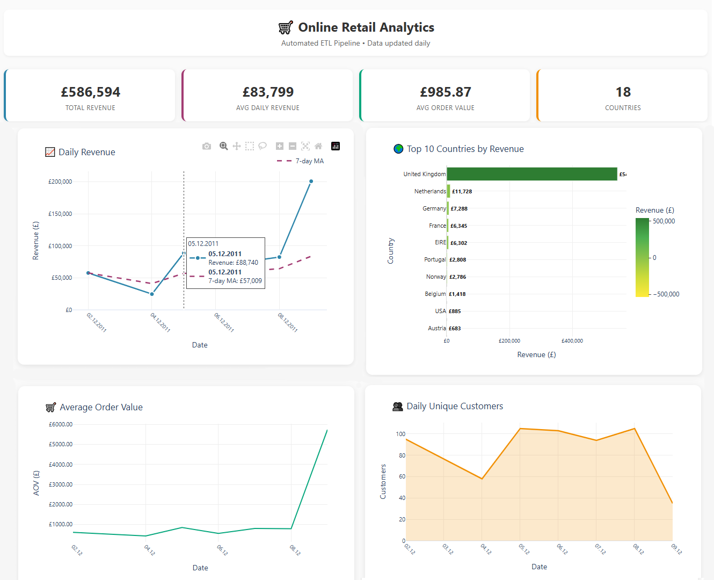

# 🛒 Online Retail ETL & Analytics Pipeline

> **Автоматизированный пайплайн обработки e-commerce данных: от сырых транзакций до интерактивного дашборда.**  
> Демонстрирует полный цикл работы дата-аналитика: инженерные практики (ETL, dbt, оркестрация), контроль качества данных, расчёт бизнес-метрик и визуализацию.

---

## 🎯 Бизнес-задача
Ручная подготовка отчётов по продажам занимала **~2 часа/неделю**, содержала риски человеческих ошибок и не имела автоматических проверок качества.  
Проект автоматизирует загрузку, очистку, трансформацию и визуализацию данных, обеспечивая:
- ✅ Ежедневный пересчёт KPI без участия аналитика
- ✅ 100% покрытие ключевых метрик тестами качества
- ✅ Готовые инсайты: динамика выручки, AOV, активность клиентов, географическое распределение

---

## 🏗 Архитектура данных
```
[Excel/CSV] 
     ↓
Python (Extract & Clean) → Обработка отмен, возвратов, пропусков, расчёт Revenue
     ↓
DuckDB (raw schema) → Хранение сырых данных
     ↓
dbt Core (Transform & Test) → stg_orders → fct_daily_sales
     ↓
Prefect 2.x (Orchestrate) → Cron-расписание, логирование, retry-логика
     ↓
CSV Report + Plotly HTML Dashboard → Готовые к употреблению инсайты
```

---

## 🛠 Технологический стек
| Компонент | Инструмент | Зачем |
|-----------|------------|-------|
| **Extract/Load** | `Python`, `Pandas`, `OpenPyXL` | Очистка специфики датасета (отмены `C*`, возвраты `<0`, guest-заказы) |
| **Хранилище** | `DuckDB` | Быстрая аналитическая БД, 0 конфигурации, идемпотентность |
| **Трансформация** | `dbt Core`, `dbt-duckdb` | Модульные SQL-модели, документация, тесты данных, lineage |
| **Оркестрация** | `Prefect 2.x` | Расписание, мониторинг, обработка ошибок, локальный агент |
| **Визуализация** | `Plotly`, `Pandas` | Информативный HTML-дашборд |
| **Контроль версий** | `Git` | Воспроизводимость, code review, готовность к CI/CD |

---

## 🚀 Быстрый старт

### 1. Подготовка окружения
```bash
git clone <your-repo-url>
cd sales-etl-pipeline
python -m venv venv
source venv/bin/activate  # Windows: venv\Scripts\activate
pip install -r requirements.txt
```

### 2. Подготовка данных
Поместите файл `online_retail.xlsx` в папку `data/`.  
*(Исходный датасет: [UCI Online Retail](https://archive.ics.uci.edu/ml/datasets/Online+Retail))*

### 3. Запуск пайплайна
```bash
# Одноразовый тестовый запуск
python -c "from orchestrate import retail_pipeline; retail_pipeline()"

# Или запуск с расписанием (09:00 ежедневно)
python orchestrate.py
```

### 4. Генерация дашборда
```bash
# Все данные
python reports/generate_dashboard.py

# Только последние 7 дней
DASHBOARD_DAYS=7 python
```
📄 Отчёт сохранится в `reports/daily_metrics.csv`  
🌐 Дашборд сохранится в: `reports/retail_dashboard.html` 

## 🌐 [Live Demo Dashboard](https://alekseikholin.github.io/retail_dashboard/)


---

## 📊 Дашборд и выходные данные
| Виджет | Источник | Бизнес-инсайт |
|--------|----------|---------------|
| 📈 Daily Revenue + 7-day MA | `fct_daily_sales` | Сезонность, тренды, пиковые дни |
| 🌍 Top 10 Countries | `fct_daily_sales` | Географическая концентрация выручки |
| 🛒 Average Order Value | `fct_daily_sales` | Эффективность ценовой политики |
| 👥 Unique Customers | `fct_daily_sales` | Динамика привлечения/удержания |

**Особенности реализации:**
- Hover-подсказки с форматированием валюты и дат
- Фильтрация по периоду через `.env` (`DASHBOARD_DAYS`)

---

## 🧪 Контроль качества данных (dbt tests)
Проект использует встроенные и кастомные тесты `dbt` для гарантии консистентности:

| Тест | Модель | Что проверяет |
|------|--------|---------------|
| `not_null` + `unique` | `stg_orders.order_id` | Отсутствие дублей и пропусков в заказах |
| `dbt_utils.accepted_range` | `stg_orders.total_quantity` | `Quantity ≥ 0` |
| `dbt_utils.expression_is_true` | `fct_daily_sales.daily_revenue` | `Revenue ≥ 0` |
| `not_null` | `fct_daily_sales.daily_revenue` | Корректность агрегатов |

```bash
cd sales_dbt
dbt deps          # установка dbt_utils
dbt run && dbt test
```

---

## 📈 Бизнес-результаты
| Метрика | До | После |
|---------|----|-------|
| ⏱️ Время подготовки отчёта | ~2 часа вручную | 3 минуты автоматически |
| 🔄 Воспроизводимость | Зависит от аналитика | Полная: код + конфиг + Git |
| 🛡️ Качество данных | Ручная выборочная проверка | 100% автоматическое покрытие тестами |
| 📊 Доступность инсайтов | Запрос к аналитику | Самостоятельный доступ через дашборд |

---

## 📂 Структура проекта
```
sales-etl-pipeline/
├── .env                          # Конфигурация путей и параметров
├── requirements.txt              # Фиксированные версии зависимостей
├── extract_load.py               # Загрузка, очистка, загрузка в DuckDB
├── orchestrate.py                # Prefect flow: расписание, логирование, retry
├── sales_dbt/                    # dbt Core проект
│   ├── models/
│   │   ├── staging/stg_orders.sql
│   │   └── marts/fct_daily_sales.sql
│   ├── tests/                    # Кастомные тесты
│   ├── _models.yml, _sources.yml # Документация и тесты
│   ├── profiles.yml              # Подключение к DuckDB
│   └── dbt_project.yml
├── reports/
│   ├── generate_dashboard.py     # Генерация Plotly HTML
│   └── daily_metrics.csv         # Экспорт агрегированных метрик
└── README.md
```
---


## 🔗 Ссылки & Ресурсы
- 📊 [Исходный датасет](https://archive.ics.uci.edu/ml/datasets/Online+Retail)
- 📘 [Документация dbt](https://docs.getdbt.com/)
- ⚙️ [Prefect 2.x Docs](https://docs.prefect.io/)
- 📈 [Plotly Python](https://plotly.com/python/)

